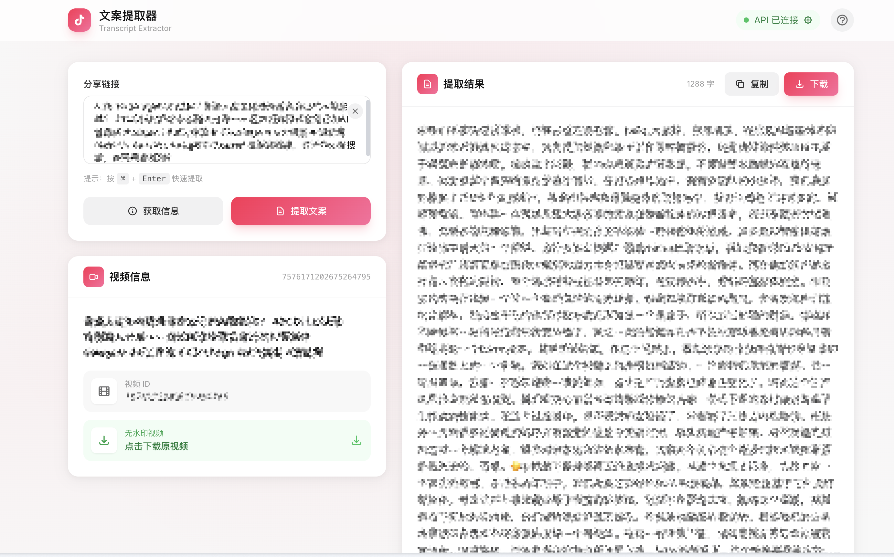

# 抖音链接转写与口播整理

[](https://opensource.org/licenses/Apache-2.0)

从抖音分享链接自动解析媒体，本机生成逐字稿，再整理成可用口播文案。



> 本项目基于 [yzfly/douyin-mcp-server](https://github.com/yzfly/douyin-mcp-server) 继续维护；保留原项目的 Apache-2.0 许可。

## ✨ 功能特性

- 🎬 **无水印视频** - 获取高质量无水印视频下载链接
- 🛟 **自动降级** - HTTP 解析失败时使用共享 Playwright 捕获签名音频
- 🎙️ **本地语音识别** - `faster-whisper-medium / CPU int8`，不消耗 ASR API
- ✍️ **口播整理** - DeepSeek 去重复、补标点和结构，保留原意
- 🌐 **WebUI** - 现代化浏览器界面，无需命令行
- 🔌 **MCP 集成** - 支持 Claude Desktop 等 AI 应用

## 项目结构

```text
assets/                 预览图和发布用 skill 包
douyin_mcp_server/      Python 核心包
scripts/                命令行入口
skills/douyin-video/    可复用的工作流说明
tests/                  单元测试
web/                    FastAPI WebUI
```

## 📦 使用方式

| 方式 | 适用场景 | 特点 |
|------|----------|------|
| [**WebUI**](#-webui-推荐) | 普通用户 | 浏览器操作，最简单 |
| [**MCP Server**](#-mcp-server) | Claude Desktop 用户 | AI 对话中直接调用 |
| [**命令行**](#️-命令行工具) | 开发者 | 批量处理，脚本集成 |

---

## 🌐 WebUI (推荐)

最简单的使用方式，打开浏览器即可使用。

### 快速开始

```bash
# 1. 克隆你自己的仓库
git clone <your-repository-url>
cd douyin-mcp-server

# 2. 安装依赖
uv sync --extra web

# 3. 启动服务
uv run python web/app.py
```

打开浏览器访问 **http://localhost:8080**

### 配置 DeepSeek API Key

有两种方式配置 API Key：

**方式一：浏览器内配置**

1. 打开 WebUI 页面
2. 点击顶部的「API 未配置」按钮
3. 在弹窗中输入 API Key 并保存
4. API Key 保存在浏览器本地，仅随提取请求发送给本机服务

**方式二：环境变量**

```bash
export DOUYIN_DEEPSEEK_API_KEY="<your-deepseek-api-key>"
uv run python web/app.py
```

本地 ASR 不需要密钥；DeepSeek Key 只用于最后一步口播整理。

### 功能说明

| 操作 | 说明 | 需要 API |
|------|------|:--------:|
| **获取信息** | 解析视频标题、ID，获取无水印下载链接 | ❌ |
| **提取文案** | HTTP/Playwright → 音频 → 本地 ASR → DeepSeek | ✅（仅整理） |
| **下载视频** | 点击下载链接保存无水印视频 | ❌ |
| **复制/下载文案** | 一键复制或下载 Markdown 格式文案 | - |

### 使用步骤

1. **粘贴链接** - 将分享链接粘贴到输入框
2. **点击按钮** - 选择「获取信息」或「提取文案」
3. **查看结果** - 右侧显示视频信息和提取的文案
4. **导出** - 复制文案或下载 Markdown 文件

---

## 🚀 MCP Server

在 Claude Desktop、Cherry Studio 等支持 MCP 的应用中使用。

### 配置方法

编辑 MCP 配置文件，添加：

```json
{
  "mcpServers": {
    "douyin-mcp": {
      "command": "uvx",
      "args": ["douyin-mcp-server"],
      "env": {
        "DOUYIN_DEEPSEEK_API_KEY": "<your-deepseek-api-key>"
      }
    }
  }
}
```

`DOUYIN_DEEPSEEK_API_KEY` 只放运行环境，不写入仓库、输出文件或运行报告。

### 可用工具

| 工具名 | 功能 | 需要 API |
|--------|------|:--------:|
| `parse_douyin_video_info` | 解析视频信息 | ❌ |
| `get_douyin_download_link` | 获取下载链接 | ❌ |
| `extract_douyin_text` | 自动降级、本地转写并整理口播 | ✅（仅整理） |
| `recognize_audio_file` | 本机 faster-whisper 识别音频 | ❌ |
| `recognize_audio_url` | 识别在线音频链接 | ✅ (百炼) |

### 对话示例

```
用户：帮我提取这个视频的文案 https://v.douyin.com/xxxxx/

Claude：我来帮你提取视频文案...
[调用 extract_douyin_text 工具]
提取完成，文案内容如下：
...
```

---

## 🛠️ 命令行工具

适合开发者和批量处理场景。

### 安装

```bash
git clone https://github.com/yzfly/douyin-mcp-server.git
cd douyin-mcp-server
uv sync
```

### 命令说明

```bash
# 查看帮助
uv run python scripts/douyin_downloader.py --help

# 获取视频信息（无需 API）
uv run python scripts/douyin_downloader.py -l "分享链接" -a info

# 下载无水印视频
uv run python scripts/douyin_downloader.py -l "分享链接" -a download -o ./videos

# 提取文案（本地 ASR；整理阶段需要 DOUYIN_DEEPSEEK_API_KEY）
export DOUYIN_DEEPSEEK_API_KEY="<your-deepseek-api-key>"
uv run python scripts/douyin_downloader.py -l "分享链接" -a extract -o ./output

```

### 输出格式

```
output/
└── 7600361826030865707/
    ├── audio.m4a          # 已校验的完整音频
    ├── transcript-raw.md  # 本地 ASR 原始逐字稿
    ├── copy.md            # DeepSeek 整理后的口播
    ├── metadata.json
    └── run-report.json    # 五阶段状态和验证证据
```

---

## 📋 系统要求

| 依赖 | 说明 | 安装方式 |
|------|------|----------|
| uv | Python 包管理 | `curl -LsSf https://astral.sh/uv/install.sh \| sh` |
| Python | 3.10–3.13（推荐 3.12） | `uv python install 3.12` |
| FFmpeg | 音视频处理 | `brew install ffmpeg` (macOS) <br> `apt install ffmpeg` (Ubuntu) |
| faster-whisper medium | 本地 ASR 权重 | 默认读取 `D:\AI_Tools\models\huggingface\hub` |
| Playwright | HTTP 解析失败后的浏览器降级 | Windows 使用 `D:\AI_Tools\bin\playwright-node.cmd` |

---

## 🔧 技术说明

### 固定工作流

1. HTTP 解析分享链接；失败时自动降级到 Playwright。
2. HTTP 分支下载视频；浏览器分支按 Range 下载签名音频。
3. HTTP 分支用 FFmpeg 抽音；浏览器分支用 ffprobe 校验完整音频。
4. 本机 `faster-whisper-medium / CPU int8` 生成带时间戳逐字稿。
5. DeepSeek 整理成口播文案，并写入 `run-report.json`。

---

## 📝 更新日志

### v1.5.0（当前工作站版）

- HTTP 解析失败自动降级到共享 Playwright
- 使用本机 `faster-whisper-medium / CPU int8`，ASR 不再依赖云端 API
- 使用 DeepSeek V4 Flash 整理口播文案
- 固定输出音频、原始逐字稿、整理文案、元数据和运行报告

### v1.4.1

- 🔧 **MCP Server 修复** - `API_KEY` 现在正确对应硅基流动密钥，与文档一致；同时兼容旧版 `DASHSCOPE_API_KEY` 配置
- ♻️ **恢复工具** - 恢复 `recognize_audio_file` / `recognize_audio_url` 工具及 `extract_douyin_text` 的 `context` 参数
- 🛡️ **WebUI 安全加固** - 下载接口不再代理任意 URL，默认仅监听本机
- ⚡ **WebUI 性能** - 提取文案不再阻塞其他请求
- 📦 **依赖精简** - WebUI 依赖改为可选安装（`pip install "douyin-mcp-server[web]"`）

### v1.4.0

- 🌐 **WebUI** - 新增浏览器可视化界面
- 🔑 **浏览器配置 API Key** - 无需环境变量
- 📑 **大文件支持** - 自动分段处理长音频

### v1.3.0

- ✨ Claude Code Skill 支持
- 📄 Markdown 格式输出

### v1.2.0

- 🔄 API 升级

### v1.0.0

- 🎉 首次发布

---

## ⚠️ 免责声明

- 本项目仅供学习和研究使用
- 使用者需遵守相关法律法规
- 禁止用于侵犯知识产权的行为
- 作者不对使用本项目产生的损失承担责任

---

## 📄 许可证

Apache License 2.0

## 🤝 贡献

提交 Issue 或 Pull Request 前，请阅读 [CONTRIBUTING.md](CONTRIBUTING.md)。安全问题请按 [SECURITY.md](SECURITY.md) 的方式私下报告。

准备发布到自己的 GitHub 仓库前，请把 `pyproject.toml` 中的 `project.urls` 补成你的仓库地址，并按需要修改项目名称和作者信息。

## 上游来源

原始项目作者：**yzfly**（[GitHub](https://github.com/yzfly)）。
